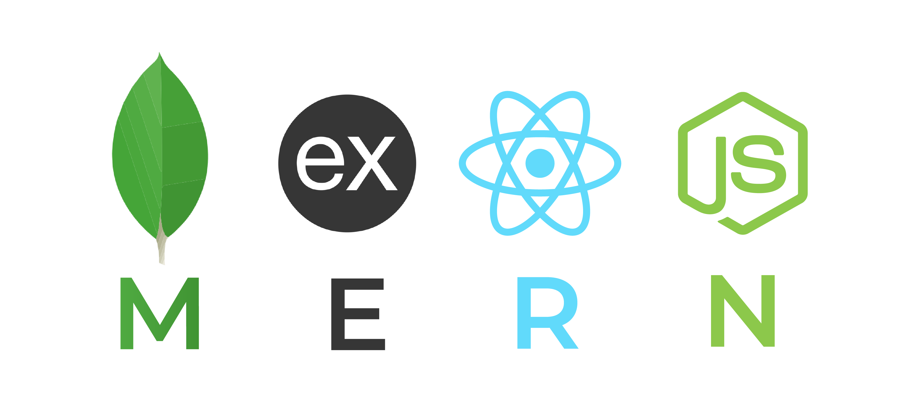
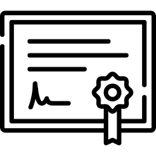
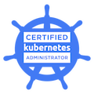
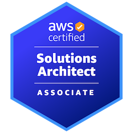
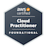

### Hi there 👋  I'm Priyanshu! 

- 💻 a DevOps engineer and a full-stack developer, 📍 based in Bengaluru (India), 💼 with 3 years of work experience
- 👨‍💻 currently working with  Kubernetes,  Terraform,  Azure &  MERN Stack.
- 📚 I’m currently learning  Istio,  ArgoCD &  ELK Stack
-  Certified with: 
    -  Certified Kubernetes Administrator
    -  AWS Solutions Architect-Associate
    -  AWS Certified Cloud Practitioner
    -  Microsoft Certified: Azure Fundamentals 
-  My upcoming certification exams in next two months: CKS, CKAD, AZ-700, AZ-104 & AZ-400

### Contact

<!--
**psshri/psshri** is a ✨ _special_ ✨ repository because its `README.md` (this file) appears on your GitHub profile.

Here are some ideas to get you started:

- 🔭 I’m currently working on ...
- 🌱 I’m currently learning ...
- 👯 I’m looking to collaborate on ...
- 🤔 I’m looking for help with ...
- 💬 Ask me about ...
- 📫 How to reach me: ...
- 😄 Pronouns: ...
- ⚡ Fun fact: ...
-->

## Skills
- [Skill #1]
- [Skill #2]
- [Skill #3]
- [Skill #4]
- [Skill #5]

## Contact
- [LinkedIn](https://www.linkedin.com/in/yourusername/)
- [Email](mailto:youremail@example.com)
- [Website](https://www.yourwebsite.com/)

Feel free to reach out to me if you have any questions or would like to collaborate on a project!
