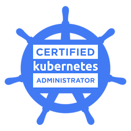
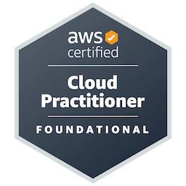

### Hi there 👋  I'm Priyanshu! 

- 💻 a DevOps engineer and a full-stack developer, 📍 based in Bengaluru (India), 💼 with 3 years of work experience
- 👨‍💻 currently working with  Kubernetes,  Terraform,  Azure &  MERN Stack.
- 📚 I’m currently learning  Istio,  ArgoCD &  ELK Stack
-  Certified with: 
    -  Certified Kubernetes Administrator 
    -  AWS Solutions Architect-Associate 
    -  AWS Certified Cloud Practitioner 
    -  Microsoft Certified: Azure Fundamentals 
    
 
-  My upcoming certification exams in next two months: CKS, CKAD, AZ-700, AZ-104 & AZ-400

### Contact
<!--  
 -->

### Contact

